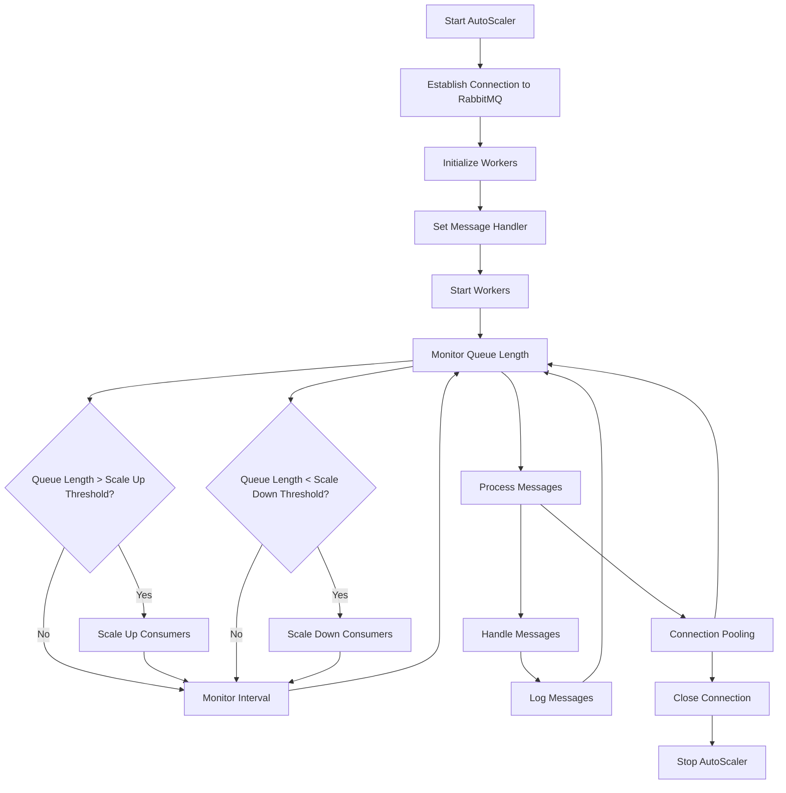

## DAG

```mermaid
graph TD
    A[Start AutoScaler] --> B[Establish Connection to RabbitMQ]
    B --> C[Initialize Workers]
    C --> D[Set Message Handler]
    D --> E[Start Workers]
    E --> F[Monitor Queue Length]
    F --> G{Queue Length > Scale Up Threshold?}
    G -- Yes --> H[Scale Up Consumers]
    G -- No --> I[Monitor Interval]
    I --> F
    H --> I
    F --> J{Queue Length < Scale Down Threshold?}
    J -- Yes --> K[Scale Down Consumers]
    J -- No --> I
    K --> I
    F --> L[Process Messages]
    L --> M[Handle Messages]
    M --> N[Log Messages]
    N --> F
    L --> O[Connection Pooling]
    O --> F
    O --> P[Close Connection]
    P --> Q[Stop AutoScaler]

```